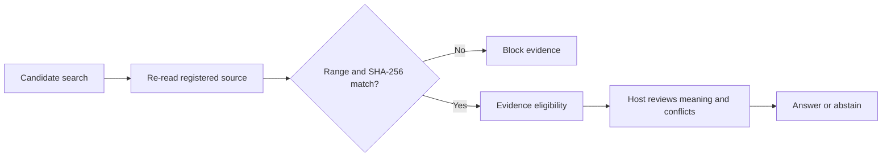

<div align="center">

# Universal Research MCP

**Research memory with traceable sources and explicit write approval.**

[](https://pypi.org/project/universal-research-mcp/0.8.5/)
[](https://pypi.org/project/universal-research-mcp/0.8.5/)
[](https://github.com/mp-juns/universal-research-mcp/actions/workflows/ci.yml)
[](LICENSE)

[한국어 사용자 설명서](docs/user-guide.md) · [60-second workflow](docs/demo.md) · [Architecture](#architecture) · [Design decisions](#three-design-decisions) · [Evidence & limits](#experiments-and-limits)

</div>

Universal Research MCP connects a Codex host to research records, original
sources, and rebuildable search indexes. Before a material claim can receive
an evidence-eligibility receipt, the server re-reads the **exact registered
source range** and checks its **current SHA-256 revision**.

**The contract:** search returns candidates; verification establishes source
integrity; the host still reviews relevance, conflicts, and the final claim.

> **v0.8.5 documentation release.** The runtime feature baseline remains
> frozen at v0.8.4. This release adds the detailed Korean user guide and ships
> the session-scope confirmation workflow; it adds no retrieval or ingest
> capability and grants no operating-system or host permissions.

## The problem it addresses

A retrieved passage can come from an old index, the wrong line range, or a file
that changed after registration. A plausible answer can hide that broken
connection. This project makes the connection inspectable.

| Question | Implemented boundary |
| --- | --- |
| Which evidence did the answer use? | An event ID, source path, exact line range, and registered SHA-256. |
| Is that still the same source? | Fresh source reads, exact locator checks, and explicit mismatch handling. |
| Can the agent rewrite research history? | MCP ingestion needs an immutable draft and an external one-time approval receipt. |
| Does passing the check mean the claim is true? | No. Semantic support, conflict resolution, and source truth remain outside this check. |

## Architecture



The workflow verifies source identity and location. It does not decide whether
the source is relevant, resolve conflicts, or prove that the source is true.

**Write path:** prepare immutable draft → external human approval → commit the
bound transaction. A shared writer lock and journal protect canonical writes;
interrupted multi-file work remains recoverable rather than silently successful.

[Module map and authority boundaries](docs/architecture.md)

## One minute through the workflow

**[Open the demo guide →](docs/demo.md)**

The [offline interactive workflow](docs/demo.html) highlights five steps over
60 seconds. Download the HTML file and open it in a browser; GitHub's file view
shows its source. It uses only explanatory text, makes no model calls, and is
**not a recording of a live MCP run**.

| Time | What the viewer sees |
| --- | --- |
| 00–12 s | A search hit is labelled `candidate_only`. |
| 12–24 s | The registered file, exact range, and current SHA-256 are checked. |
| 24–36 s | Eligibility checks integrity, range, and count; a mismatch blocks evidence. |
| 36–48 s | The host reviews meaning, conflicts, and source quality. |
| 48–60 s | The host answers with support or explicitly abstains. |

The guide links each step to the implementation. It does not create a source
registration, approval, or benchmark.

## Three design decisions

| Decision | Why this choice | Tradeoff |
| --- | --- | --- |
| **1. Canonical JSONL; rebuildable indexes** | Preserve research history while repairing or replacing SQLite, FTS, and dense projections. | More explicit provenance and freshness checks; an index cannot be the authority. |
| **2. Journaled ingest with external approval** | Bind multiple file writes to exact before/after hashes and recover the same approved transaction after interruption. | More state and recovery logic; this is not a cross-file atomic filesystem transaction. |
| **3. A narrow supported distribution** | Ship memory, governance, retrieval, and Codex integration without promising prototype provider-runtime compatibility. | A smaller integration surface; other generation providers remain repository experiments. |

Read the decisions and alternatives:
[ADR-0001](docs/decisions/0001-canonical-authority.md) ·
[ADR-0002](docs/decisions/0002-recoverable-ingest.md) ·
[ADR-0003](docs/decisions/0003-supported-wheel-surface.md).

## Try the released package

For the complete installation, Codex setup, source-registration, approved
ingest, semantic retrieval, troubleshooting, and update flow, read the
**[Korean user guide](docs/user-guide.md)**.

```bash
python -m pip install "universal-research-mcp==0.8.5"
universal-research --version
universal-research init ./my-research
```

Expected version: `0.8.5`. Initialization creates an **empty** project; it does
not crawl your files. Use the [input tutorial](docs/input-cli-tutorial.md) to
register sources and create an approved record before expecting search results.

Then register the local server in Codex:

```toml
[mcp_servers.universal_research]
command = "universal-research"
args = ["serve", "--no-auto-index"]
cwd = "/absolute/path/to/my-research"
```

`--no-auto-index` explicitly disables index writes at startup. Refresh derived
indexes separately when that operation is approved; omitting the flag enables
automatic indexing in the CLI. Do not use a read-only reference project as the
writable research root. See the [host integration guide](docs/host-integration.md)
for the full setup.

### What ships in v0.8.5

- Lexical, local semantic, hybrid, and adaptive **candidate** retrieval.
- Exact registered-range fetch and deterministic evidence-eligibility receipts.
- Append-only records, shared CLI/MCP writer locking, and recoverable ingestion.
- Codex governance contracts and a secure harness for separately approved runs.
- An optional, explicitly published read-only demo corpus.
- Managed local semantic snapshots bound to an immutable model revision and
  verified file inventory; setup requires its own approved plan.

The supported host is **Codex**. The wheel excludes experimental generation
providers, plugin-owned agent runtime, and provider execution harness modules.
Local embeddings do not imply generation-provider support.

[Semantic retrieval](docs/semantic-retrieval.md) ·
[Secure harness](docs/secure-harness.md) ·
[Public demo deployment](docs/public-demo.md)

## Experiments and limits

**Completed development evidence exists. A full confirmatory product-effect
benchmark does not.** These are separate studies; their sample sizes and scores
must not be pooled.

### A completed 96-run development study

24 public synthetic tasks × four conditions, one run per task and condition.
The separate condition-blinded evaluator was an LLM, not a human reviewer.

<a href="benchmarks/results/integrity-claim-gate-v1-development-20260813.md"></a>

*Public synthetic development corpus: 24 tasks × 4 conditions × 1 run. The
paired 95% interval includes zero; this is not confirmatory product evidence.*

| Condition | Unsafe assertions / 18 fault tasks | Clean claim coverage | Mean tokens | Mean latency |
| --- | ---: | ---: | ---: | ---: |
| Filesystem | 4 / 18 | 66.7% | 73,596 | 23.05 s |
| Filesystem + manifest | 4 / 18 | 16.7% | 67,962 | 23.18 s |
| MCP evidence-only | 6 / 18 | 100.0% | 90,047 | 29.70 s |
| MCP + evidence eligibility | 2 / 18 | 100.0% | 113,951 | 37.21 s |

For filesystem → MCP + eligibility, the paired unsafe-assertion difference was
−11.1 percentage points, with a task-bootstrap 95% interval of **−33.3 to +11.1
points**. It includes zero. The gated condition used **1.55× tokens and 1.61×
time**, and still failed on conflicting and semantically irrelevant current
evidence. Evidence-only retrieval had more unsafe assertions than filesystem.
These are narrow development observations, **not proof of general
hallucination reduction or improved research quality**.

Methods, evaluation cost, and all caveats remain in the
[full four-condition report](benchmarks/results/integrity-claim-gate-v1-development-20260813.md).
Historical reports call the eligibility check “Claim Gate”; those names are
retained for provenance, not a claim that the tool verifies truth.

### Other evidence, kept separate

| Evidence | Status | What it can establish |
| --- | --- | --- |
| Earlier retrieval and safety pilots | Completed, exploratory | Narrow source-mutation observations and overhead, including negative findings. |
| A/B/C integration diagnostic, 2026-08-26 | Completed; one task, three responses plus seven startup diagnostics | Tool integration with retained failures. Unequal input budgets and no repetitions prevent an efficacy comparison. |
| Full 432-trial comparison | **Not a completed result** | A planned count is not evidence. No finished 432-trial result is claimed for v0.8.5. |
| Software tests and release checks | Engineering verification | Contract and packaging behavior; not participant-model benchmark results. |

[All five completed reports](benchmarks/results/README.md) ·
[Integration diagnostic](benchmarks/results/abc-integration-diagnostic-20260826.md) ·
[Benchmark disclosure](docs/benchmark-disclosure.md)

### Boundaries that remain

- Hashes establish revision identity, not the truth of source prose.
- Evidence count is based on distinct event records, not independent authors
  or independent scientific observations.
- The MCP cannot globally control native agents or other processes started by
  an unrestricted host. Approval enforcement has a defined execution boundary.
- This is not an authenticated private remote service or a multi-tenant SaaS.
  Public deployment needs a separately reviewed operational boundary.
- Historical synthetic results do not establish released-v0.8.5 efficacy,
  production reliability, or statistically decisive superiority.

[Security model](docs/security.md) · [Governance contracts](docs/multi-agent-governance.md)

## Development reference

<details>
<summary>Existing checks and release process</summary>

```bash
python -m pip install ".[test]"
python -m pytest -q
ruff check universal_research_mcp
mypy --no-incremental --cache-dir=/dev/null universal_research_mcp
python -m build
python scripts/validate_distribution_artifact.py dist/*.whl
python scripts/ci_smoke.py dist/*.whl
```

Release workflows pin third-party actions to exact commits. A release wheel is
built once, checked on Linux/macOS/Windows, and that artifact is published
through PyPI Trusted Publishing after its release gates succeed. These are
engineering checks, separate from model experiments.

</details>

License: [MIT](LICENSE)
