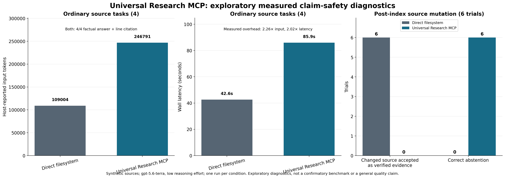
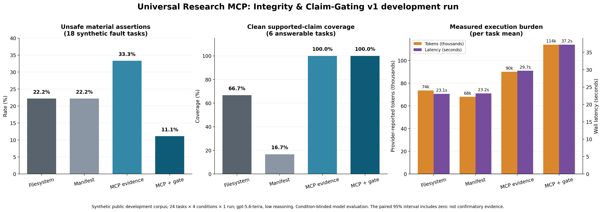

# Universal Research MCP

[](https://pypi.org/project/universal-research-mcp/)
[](https://pypi.org/project/universal-research-mcp/)
[](https://github.com/mp-juns/universal-research-mcp/actions/workflows/ci.yml)
[](LICENSE)

**[Install from PyPI](https://pypi.org/project/universal-research-mcp/)** ·
**[Read the documentation](https://github.com/mp-juns/universal-research-mcp#readme)** ·
**[Report an issue](https://github.com/mp-juns/universal-research-mcp/issues)**

Universal Research MCP is a provenance-first, append-only research operations
framework and governed MCP. It records plans, approvals, observations, claims,
failures, amendments, and contributions with traceable sources. Canonical JSONL
is authoritative; SQLite search indexes are verified, replaceable derived views.

```bash
python -m pip install --upgrade universal-research-mcp
```

After installation, use either the full `universal-research` command or the
short `urmcp` alias. The PyPI distribution name remains
`universal-research-mcp`, so users can find the authoritative package and its
release history in one place.

> **Supported integration (0.5.1): Codex only.** Codex owns model
> selection, agent sessions, tool execution, approvals, and GUI presentation.
> Ollama, OpenAI API, Anthropic API, Moonshot/Kimi, Claude Code, OpenCode, and
> OpenClaw are not supported or invoked by this release.

The repository can contain provider or runtime prototypes for future research.
They are not exposed through the default CLI, Codex plugin, MCP tools, or
package entry points, and are not a compatibility promise.

## Quick start

### Secure Codex/Docker harness preview

The opt-in secure harness keeps Codex on the host and runs only sealed test,
build, and experiment recipes in offline, resource-bounded Docker workers. The
original project is never mounted into a worker, visualization is disabled, and
edits stay quarantined until their exact diff hash is approved. See
[the secure harness guide](docs/secure-harness.md). This preview does not claim
to be a custom Codex runtime or a complete multi-provider agent scheduler.


Python 3.11 or newer is required.

```bash
python -m pip install universal-research-mcp
universal-research init ./my-research
universal-research serve --root ./my-research
```

When run directly in a terminal, `serve` shows its startup phases on the
terminal's status stream—for example index check, staged rebuild, verification,
and `100% ready for MCP requests`. This never writes to the MCP protocol
stream. It is enabled by default for an interactive terminal and disabled by
default for a non-interactive MCP host. Override it with
`--startup-progress` or `--no-startup-progress`.

`init` creates an independent empty canonical source registry and a verified
FTS5 lexical index. It reports the semantic index as `missing`; it does not
silently create an empty semantic database, download a model, or contact an
embedding API. A lexical refresh that does not alter canonical JSONL is staged,
validated, and atomically replaced. Select the research root with `--root` or
`UNIVERSAL_RESEARCH_ROOT`.

### Optional semantic and hybrid candidate retrieval

After canonical records exist, semantic retrieval is an explicit project-level
choice. The offline demo backend creates no download, GPU, credential, or
network request, and is useful for checking the full semantic/hybrid workflow:

```bash
universal-research semantic configure --backend demo --root ./my-research
universal-research semantic build --root ./my-research
universal-research semantic status --root ./my-research
```

The demo identifies itself as `backend_class=deterministic_demo` and
`trained_embedding_model=false`. It is a reproducible retrieval fixture, **not**
a learned embedding model or a quality claim. For a pinned model already present
on disk, configure `--backend local --model-path /absolute/path/to/model`; the
command never downloads a snapshot. A configured semantic view is rebuilt only
when `--auto-refresh` was explicitly selected; otherwise canonical writes leave
it stale and print a recovery command. Remote embedding remains unsupported by
the public MCP and is never invoked by `serve`.

### Local SentenceTransformer setup

`pip install universal-research-mcp` never creates a virtual environment or
downloads a model. To install the optional library dependencies into your
current Python environment, use `pip install "universal-research-mcp[semantic]"`.
To keep a research project self-contained instead, use the built-in guided
setup. It offers a reviewed catalogue of ten local SentenceTransformer models;
the Korean/multilingual default is `intfloat/multilingual-e5-base` (768
dimensions). The catalogue includes compact, balanced, and large English and
multilingual alternatives.

```bash
universal-research semantic models
universal-research semantic setup --root ./my-research \
  --model intfloat/multilingual-e5-base --device cuda
```

The first command only prints a plan and a `plan_sha256`. With the default
environment manager, setup uses Conda when the `conda` executable is available
and otherwise selects Python `venv`. It does not create either one yet. Review
the planned environment path, package version, model revision, device, and
network use; then repeat the exact hash to authorize the mutating operation:

```bash
universal-research semantic setup --root ./my-research \
  --model intfloat/multilingual-e5-base --device cuda --execute \
  --confirm-plan-sha256 <plan_sha256>
```

The confirmed step creates or explicitly reuses
`./my-research/.universal-research/semantic-env`, installs the exact package
version with its `semantic` extra, downloads only the selected reviewed model
to `./my-research/.universal-research/models/`, and writes the local semantic
configuration. It does **not** build an index or start a model. Its result gives
the environment-specific `semantic build` and `serve` commands. Point Codex's
MCP server command to that returned environment-specific `universal-research`
executable only after reviewing the host configuration change.

Use `--revision <immutable-model-commit>` instead of the default `main` when
reproducibility matters. Setup will never replace an existing environment or
model directory unless you regenerate the plan with `--reuse-existing` and
confirm its new hash. The system uses `trust_local_model_code=false`; arbitrary
repository IDs, raw model code, external provider APIs, and automatic model
downloads are not accepted through this flow.

See the full [canonical input tutorial](docs/input-cli-tutorial.md) for a
source → human approval → guarded record append → lexical search workflow.

### Declarative research profiles

For a repeatable project policy, use a JSON profile. It can declare whether
candidate retrieval is lexical, semantic, or hybrid; select the already-present
offline demo or local-GPU backend; bound source discovery to documentation,
source code, build definitions, and configuration; and record approved future
provider routes. It is not an agent runner or credential store.

```bash
universal-research profile template > research-profile.json
universal-research profile validate research-profile.json --root ./my-research
# Review the returned profile_sha256, then repeat it exactly:
universal-research profile apply research-profile.json --root ./my-research \
  --confirm-profile-sha256 <profile_sha256>
universal-research profile status --root ./my-research
```

The template is lexical-only, network-disabled, and keeps the documented source
categories available for a later explicit registration step. To enable the
offline reproducible semantic fixture, change the profile's `retrieval` section
to:

```json
{
  "mode": "hybrid",
  "semantic_backend": {
    "kind": "demo",
    "dimensions": 256,
    "auto_refresh": false
  }
}
```

Then run `universal-research semantic build --root ./my-research`. For a local
GPU model already on disk, use `kind: "local"`, a `model_path`, and
`device: "cuda"`; applying the profile never downloads or loads that model.
The public MCP exposes the profile's status but cannot call a declared OpenAI,
Anthropic, Ollama, or other provider route. A remote route requires an explicit
`network_enabled: true` declaration and an `env:NAME` credential reference;
the profile never contains a raw API key and the public MCP still does not read
it or make the call.

Profiles can select only the package's registered Codex Skills
(`research-governance`, `research-workflow`). You can author and install another
Codex Skill, but a profile cannot create or activate it by itself. Add a new
Skill through the reviewed plugin/release path, then add its fixed ID to the
runtime registry; this prevents a retrieved document or an agent from creating
its own authority and executing it.

### First searchable input

The management CLI remains available for explicit administration. In 0.5.0,
the same `universal_research` MCP can also perform a bounded two-step ingest:

```bash
universal-research init ./my-research
# Create ./my-research/docs/note.md yourself, then register that immutable path.
universal-research source register docs/note.md --root ./my-research \
  --source-id src_note_v1 --source-type markdown
universal-research record template > protocol.json
universal-research record validate protocol.json --root ./my-research
```

For a governed record, first append a human `record_kind=approval` record with
`record approve --confirm <record-id>`. Then have Codex call
`research_prepare_ingest` with the record, that approval ID, and any new
project-contained source registrations. It stores an immutable non-canonical
pending draft and returns its ID and SHA-256. After reviewing the intended
append, issue a one-time local receipt outside the MCP process:

```bash
universal-research ingest approve --root ./my-research \
  --draft-id ingest_... --draft-sha256 <draft-sha256> \
  --confirm-draft-sha256 <draft-sha256> \
  --expires-at 2026-08-15T00:00:00+00:00
```

Then allow the host-visible mutating `research_commit_ingest` call with only
that exact draft ID, hash, and returned receipt ID.

Commit does not accept a replacement record body or `approved=true` flag. It
requires the existing human scope approval plus a signed, one-time receipt
stored outside the project; it checks the receipt, draft hash, canonical head,
and source files, consumes the receipt and draft once, then appends the record
and refreshes lexical plus an explicitly configured auto-refresh semantic index.
A derived-index failure never hides a successful canonical append; it is
reported as stale/partial in the commit audit result.
Registered paths are immutable revisions: editing or re-registering one is
rejected; register a new project-contained path instead.

The default `universal_research` MCP provides:

- candidate search and event/hash-bound source re-verification;
- deterministic claim eligibility receipts for material results, comparisons,
  causal statements, release decisions, and explicitly material facts;
- an eleven-role governance contract and Codex dispatch-manifest preparation;
- scope/cost preflight, deterministic operation-gate, and failure-tombstone
  preparation; and
- lexical, semantic, and RRF hybrid candidate retrieval plus derived-index
  status.

It never creates human approval records, treats an agent assertion as approval,
silently updates canonical history, invokes a remote API, downloads a model,
or starts a benchmark or daemon. The MCP protocol does not carry a portable,
signed proof of a specific Codex approval click. The receipt authority therefore
uses a separate user-state signing key and explicit CLI confirmation; the server
also enforces exact draft/state and human-scope checks. Query-time semantic
search uses only the explicitly configured offline backend; an unconfigured or
stale semantic view fails closed. Provider fallback is future work.

## Evidence flow

```text
canonical JSONL → staged/verified SQLite candidate → memory_fetch_evidence
with event_id + expected_sha256 → current-hash check → memory_gate_claim →
eligible or blocked material claim
```

`memory_search_candidates` accepts `mode="lexical"`, `"semantic"`, or
`"hybrid"`. Hybrid search independently ranks lexical and semantic candidates
and fuses ranks with reciprocal-rank fusion (0.45 lexical / 0.55 semantic,
`k=60`). Every result remains `candidate_only=true`; semantic similarity cannot
establish a fact, cause, comparison, or release claim. A semantic passage may
choose the returned path and exact line range, but it still must go through
`memory_fetch_evidence` and `memory_gate_claim`.

Search results are candidates, not evidence. For a consequential conclusion,
retain the evidence fetch's event ID, path, line range, expected and current
hashes, and `integrity_status`. Files not registered in the index cannot be
fetched. Search, latest, and evidence fetch fail closed while the lexical index
is stale and require `universal-research index ensure --kind lexical`. When a
file's current hash differs, content is withheld by default; only the explicit
diagnostic `allow_mismatched_content=true` response includes current content.

`memory_gate_claim` is a deterministic, fail-closed receipt for material
claims. It re-fetches each supplied exact evidence reference and accepts only a
current registered revision. Release, comparison, and causal claims require two
distinct verified records; a material factual or result claim requires one.
Routine lookups are not gated. The gate checks evidence eligibility, not the
scientific truth of prose, and it does not invoke a model or write the ledger.

## Governed Codex agents

`scope_and_cost_governor` runs before plan approval in every mode. It assesses
necessity, a bounded time estimate, work units, difficulty, compute/network
cost, and evidence; it does not approve execution or kill a process. The common
operation gate performs a declarative preflight bound to an approved
`scope_hash` and always returns `execution_authorized=false`. At the real tool
boundary, the Codex host must compare the gate hash with a closed,
action-specific argument envelope before deciding whether to execute.

The plugin prepares a role-specific task packet, hash-bound scope receipt, and
Codex dispatch manifest over one evidence snapshot. A manifest does not start
an agent. Codex may create native subagents and decide their sessions, model,
parallelism, and GUI surface under host permissions and the user's entitlement.
The plugin does not bypass a Codex subscription by routing work to a paid API.

The default failure policy is `blocking_only + ask + redacted`. A minimum
failure tombstone is always retained, while detail retention is configurable as
`full | metadata_only | ask` and `full | redacted | hashes_only`. There is no
unrecorded `off` mode.

Host visualization is off by default. It requires both explicit user opt-in and
a separately approved capability scope/plan reference. Permission to generate a
normal data plot does not imply permission to invoke a host visualization skill.

Token accounting uses only exact counts supplied by a provider or host. If the
host does not expose an exact count for commands, code generation, Skills, or
visualization, that category is `unavailable`, not zero or an estimate.

## Benchmark status

The repository provides paired A/B protocols, fixture contracts, and scoring
contracts. No confirmatory live A/B result is available.



The graphic reports two public, exploratory live diagnostics using synthetic
sources, `gpt-5.6-terra`, low reasoning effort, and one run per condition. On
four ordinary single-source tasks, both conditions achieved 4/4 factual answers
with evidence-line citations; the MCP condition used 2.26× input tokens and
2.02× wall latency. In the separate six-trial post-index source-mutation
diagnostic, direct filesystem retrieval accepted the changed source as verified
evidence in 6/6 trials, while MCP-gated retrieval accepted it in 0/6 and
abstained correctly in 6/6. This is bounded evidence for stale-source
protection, not evidence of general hallucination reduction, research-quality
improvement, or model superiority. See the machine-readable
[directional source diagnostic](benchmarks/results/codex-directional-v1.json)
and the [claim-safety pilot](benchmarks/results/codex-claim-safety-v3.md).

The narrower public development protocol
[`integrity-claim-gate-v1`](benchmarks/protocols/integrity-claim-gate-v1.md)
has now been executed once: 24 public synthetic tasks × 4 conditions = 96
participant runs, with a separate condition-blinded evaluator. The observed
MCP + Claim Gate condition had 2/18 unsafe material assertions on fault tasks
(11.1%), versus 4/18 (22.2%) for direct filesystem; clean supported-claim
coverage was 100.0% versus 66.7%. It cost 1.55× mean execution tokens and
1.61× mean latency. The paired 95% interval for the unsafe-assertion
difference includes zero, so this is **not** proof of an effect. It is a
development-sample signal plus a measured burden and known semantic failure
modes. See the complete
[development result](benchmarks/results/integrity-claim-gate-v1-development-20260813.md).



Future runs must use the same model, prompt, tasks, permissions, and source
snapshot within each pair; retain failures; use paired repetitions; and
preserve raw host telemetry. The only reportable public metrics are citation
correctness, unsupported-claim rate, evidence retrieval success, total tokens,
tool calls, latency, cost, and paired differences. Missing telemetry is
`unavailable`, never inferred. See [the benchmark disclosure](docs/benchmark-disclosure.md).

## Boundaries and data authority

Reference projects are read-only design inputs. Universal Research does not
create, modify, delete, move, or append their files, event logs, databases,
results, or session records. Their embedding databases may be read only to
understand a schema, metadata, or adapter design. The new project never copies
or shares a reference runtime database.

Semantic/hybrid retrieval is a hardened successor to the public
[Evidence-First Research Memory predecessor prototype](https://github.com/mp-juns/evidence-first-research-memory): it retains separate lexical/semantic
ranking and source-range candidates, while adding registered-file SHA-256
re-verification, stale fail-closed behavior, and deterministic claim gating.

1. `data/events/` JSONL is the canonical event ledger.
2. `data/index/` SQLite and any embedding index are rebuildable derived views.
3. Original sources and artifacts verify candidate results.
4. Embedding similarity alone cannot establish a fact, cause, or performance
   claim.

Project-local working notes, when used, are not canonical records and are not
distributed with the package.

## Architecture

```text
universal_research_mcp/
  plugin/          Codex plugin and Skills
  core/            canonical-input and record contracts
  governance/      fixed-role governance contracts and validators
  integrations/    host-specific dispatch adapters
  data/events/     independent canonical append-only events
  data/index/      independent derived lexical/dense indexes
  docs/            specifications and usage documentation
```

The core schema defines immutable records and typed relations. Study-type and
domain packs may add restrictions but may not relax core policy. A project
profile selects paths, adapters, and reference boundaries. The MCP normally
returns candidate metadata and exact source evidence; its only canonical-write
surface is the host-visible, hash-bound two-step ingest boundary.

## Current support and next steps

This release supports the Codex plugin, local lexical lifecycle,
source-grounded evidence fetch, guarded canonical ingestion, eleven-role
governance, and non-executing Codex dispatch preparation. Installation, MCP
startup, and CI do not invoke an API, local model, model download, benchmark,
or background watcher.

The 0.4.0 namespace is intentionally breaking: public Python modules live under
`universal_research_mcp.*`; legacy general top-level package imports are not
provided as shims. Independently reviewed adapters for other hosts remain
separate work.
