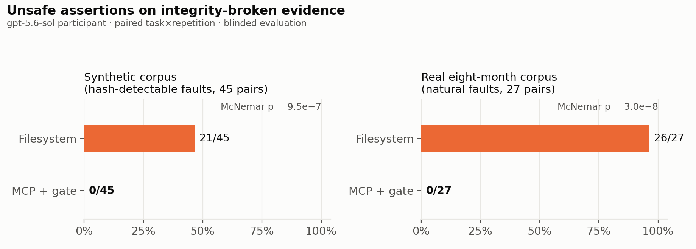
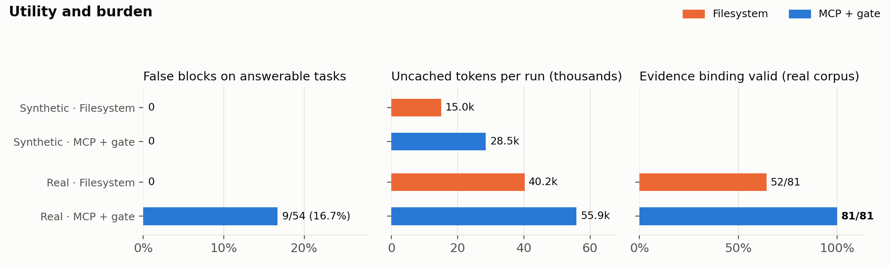
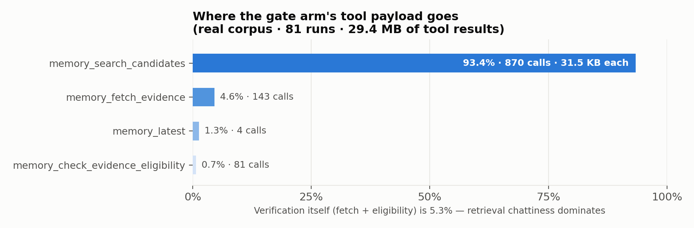
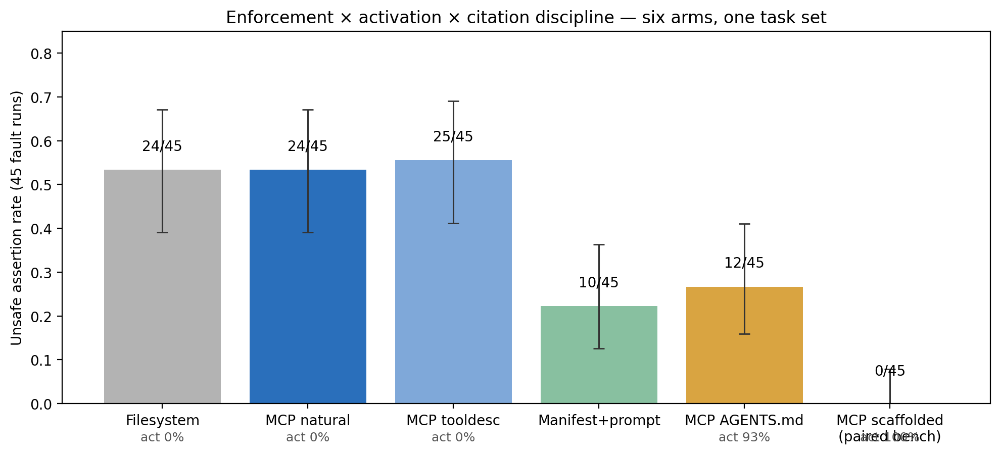

<div align="center">

# Universal Research MCP

**Research memory with traceable sources, explicit write approval, and measured — not assumed — safety.**

[](https://pypi.org/project/universal-research-mcp/0.9.2/)
[](https://pypi.org/project/universal-research-mcp/0.9.2/)
[](https://doi.org/10.5281/zenodo.22118223)
[](https://github.com/mp-juns/universal-research-mcp/actions/workflows/ci.yml)
[](LICENSE)

[Architecture deep dive](docs/architecture-deep-dive.md) · [Benchmarks](#benchmarks--what-was-measured-how-and-what-each-result-licenses) · [Getting started](#getting-started--build-the-rag-store-connect-the-mcp) · [한국어 사용자 설명서](docs/user-guide.md)

</div>

Research agents with long-lived memory fail in a specific way: they
**assert recorded values whose evidence no longer holds** — the file
drifted, the claim was withdrawn, the source was never registered. This
project makes that failure mechanically checkable, fail-closed, and then
**measures which parts of safety the mechanism actually provides**.

## The structure, in one pass

```
 append-only canonical ledger            derived, rebuildable RAG
 ─────────────────────────────           ─────────────────────────────
 data/events/daily/*/events.jsonl   →    SQLite FTS5 passage+event index
 data/events/sources.jsonl               (+ optional offline semantic view
 (path → SHA-256 at registration)         built FROM the lexical index)
            │                                        │
            │ registered hash + line range           │ BM25 candidates
            ▼                                        ▼
 ┌─────────────────────────── MCP server (30 tools, stdio) ─────────────────────────┐
 │ memory_search_candidates → candidates only ("a score is not evidence")           │
 │ memory_fetch_evidence    → exact lines + integrity_status (matched/mismatched)   │
 │ memory_check_evidence_eligibility → fail-closed receipt; blocks silent omission  │
 │ research_prepare_ingest / research_commit_ingest → two-step, one-time HMAC       │
 │ governance_* (11 fixed roles; preflight only, never executes)                    │
 └──────────────────────────────────────────────────────────────────────────────────┘
```

- The ledger is the only authority; every index is a derived view that
  refuses to build over a drifted registered source.
- Retrieval is physically read-only (`sqlite mode=ro`, `query_only=ON`).
- Writes need a pre-existing human approval record; model-side ingestion
  additionally needs a one-time HMAC receipt issued **outside** the MCP.
- The eligibility gate verifies the integrity of cited evidence and — as
  of this release — fails closed when a material claim silently omits
  evidence the session fetched and saw fail integrity.

Every one of those sentences is backed by a specific file and line:
**[docs/architecture-deep-dive.md](docs/architecture-deep-dive.md)** walks
the goal, the ledger, the RAG construction, the RAG↔MCP chain, and each
control mechanism with code citations, including the boundaries that are
deliberately *not* enforced and say so in their docstrings.

## Benchmarks — what was measured, how, and what each result licenses

Every study below was **preregistered before its runs** (protocol and
analysis code committed first; deviations disclosed in the protocol before
the affected runs), scored by an independent deterministic scorer
cross-checked against a condition-blinded LLM judge (judge validity:
two independent raters agreed with each other κ = 1.000 and with the judge
κ = 0.865 on a 50-verdict blind sample), and reported as aggregates only.
Statistical choices (Wilson/Newcombe CIs, mid-p McNemar, rule-of-three)
are bound to hash-verified verbatim quotes from their source papers in
[the citation manifests](benchmarks/protocols/).

### 1 · Does the gate stop unsafe assertions? — yes, to zero, when invoked

[](benchmarks/results/integrity-claim-gate-paired-20260827.md)

**Setup.** Two paired executions, one synthetic and one real. Synthetic: 24
tasks × 2 arms × 3 reps (144 runs), each task planting one correct and one
altered value in a corpus with an injected integrity fault (post-index
mutation, line drift, stale index, withdrawn/missing/unregistered evidence,
conflicts, plus negative controls). Real: 27 tasks over an actual
eight-month research project's ledger — **every fault occurred naturally**;
nothing was mutated for the benchmark. Paired design so each task is its
own control; the model (gpt-5.6-sol, medium) and prompts are identical
across arms except evidence access.
**Why this setup.** Planted values make scoring deterministic (no judge
discretion on the primary endpoint); natural faults answer the "synthetic
faults are strawmen" objection.
**Result.** Hash-detectable fault stratum: filesystem 21–22/45 unsafe vs
gated **0/45** (RD 0.49 [0.33, 0.63]); real corpus 23–26/27 vs **0/27**
(RD 0.85 [0.64, 0.94]); clean coverage 21/21 in both arms.
**What this licenses.** *When the eligibility workflow runs, unsafe
assertions on integrity-broken evidence go to zero at no clean-coverage
cost.* It does not license "the MCP makes agents safe" — see benchmark 4.

### 2 · What does it cost? — retrieval effort, not blocking

[](benchmarks/results/real-corpus-integrity-paired-20260828.md)

**Setup.** Same paired runs, secondary endpoints: false blocks on
answerable tasks, uncached tokens, evidence-binding validity.
**Result.** False blocks 9/54 on the real corpus — all nine traced to
legacy events recorded without source references (evidence-chain quality,
not the gate, is the binding constraint). Tokens ~1.4–1.9× filesystem.
Evidence binding valid 81/81 in the gate arm vs 52/81 filesystem.
**What this licenses.** *The gate's cost is retrieval chattiness and
legacy-chain gaps, not wrongful blocking of intact evidence.*

### 3 · Where does the payload go? — search, not verification

[](benchmarks/results/real-corpus-integrity-paired-20260828.md)

**Setup.** Byte-level decomposition of all tool results in the real-corpus
gate arm (81 runs, 29.4 MB), plus a same-day optimization pass re-run.
**Result.** 93.4% of payload is candidate search; verification itself
(fetch + eligibility) is 5.3%. The optimization pass halved transport
(−49% payload) with fault-unsafe still 0.
**What this licenses.** *Verification is cheap; retrieval dominates cost
and is where optimization belongs.*

### 4 · Does anyone actually call the gate? — no, not without policy

[](benchmarks/results/rebench-ablation-v1-20260828.md)

**Setup.** The scaffold-removal ablation (preregistered, 3 arms × 24 × 3 =
216 runs): identical tasks with **no claim types, no scope preamble, no
tool naming in any prompt** — the original scaffold is the treatment being
tested. Arms: filesystem, MCP-attached-but-unprompted, and a cheap
baseline (one instruction + a registration-time hash manifest).
**Why this setup.** Benchmark 1's 0/45 was measured under an operator
prompt that told the model to use the workflow. A reviewer's question —
"if the gate isn't called, there is no protection" — required measuring
activation itself, per the tool-usage-awareness literature.
**Result.** The natural arm made **zero MCP calls in 72/72 runs** (all 30
tools verifiably exposed): unsafe 24/45, identical to filesystem
(RD exactly 0.000). The manifest baseline fixed only hash-visible faults
(10/45) and misses everything semantic.
**What this licenses.** *Effective protection = activation × enforcement,
and un-prompted activation is 0%. Any headline safety claim for an agent
memory tool must be conditioned on activation.* This is the paper's
central honest finding, not a defect disclosure.

### 5 · Can deployable artifacts recover activation? — policy yes, schema no

[](benchmarks/results/rebench-ablation-v1.1-20260829.md)

**Setup.** Preregistered amendment, 216 more runs: a repository
`AGENTS.md` policy file (workflow mandate + session-scope preapproval), a
product-only lever (activation triggers in the two tool descriptions), and
a clean rerun of the natural arm after a disclosed fixture-contamination.
**Result.** Tool-description triggers: 0/45 activation — a dead lever.
`AGENTS.md`: activation **42/45 (93%)**, unsafe halved to 12/45 — but all
12 held *eligible* receipts: in 9 the model fetched the faulted source,
saw the mismatch, silently dropped it, and cited only intact evidence.
**What this licenses.** *A one-file repository policy restores adoption;
tool schemas alone do not. And a third protection layer exists — citation
discipline — because the gate can only judge the citation set it is
given.*

### 6 · Enforcing citation discipline — information loses, enforcement wins

[](benchmarks/results/rebench-v1.2-v1.3-citation-discipline-20260829.md)

**Setup.** Two more preregistered steps (72 runs each). v1.2: the server
logs the session's fetches and the receipt *discloses* fetched-but-uncited
mismatched evidence with an instruction to abstain or address it. v1.3:
same detection, but an active material claim **fails closed**
(`OMITTED-MISMATCHED-EVIDENCE`); citing the mismatched reference lifts the
block.
**Result.** Disclosure fired with perfect precision (13/45 fault, 0/21
clean, 0/6 negative-control) and was **overridden in 9/13** — falsified by
its own preregistered rule. Enforcement: unsafe **4/45** (bar ≤ 4 met),
0/12 unsafe where the block fired, zero false blocks, clean 21/21. The
residual four are intact-hash semantic states (withdrawn, irrelevant) the
integrity gate is documented not to judge.
**What this licenses.** *The measured ordering — information < instruction
< enforcement — held at every layer tested. The enforcement ships in this
package and was verified live on the installed build.* Adversarial audit
of the governance/ingest surface: 25/25 hostile inputs fail closed
([audit](benchmarks/adversarial/audit-results-README.md)).

### What none of this licenses

Generalization beyond one model family and one real corpus;
defense against faults whose hashes are intact (withdrawn, stale-but-valid,
irrelevant evidence — measured to defeat every arm); anything about
corruption that precedes registration (both arms lose 6/6 by design);
agent behavior under the multi-agent governance contracts (the controls
fail closed under direct adversarial input, but no model-in-the-loop
governance benchmark exists yet).

## Getting started — two commands to a verified research memory

```bash
pip install universal-research-mcp        # or: uv tool install universal-research-mcp
universal-research quickstart ~/my-research --yes
```

`quickstart` takes a folder of Markdown documents and does the whole RAG
setup in one pass: initializes the store, registers every document's
SHA-256, appends an operator-approved observation per document (the
`--yes` is your human approval — without it, quickstart only prints a dry
run), and builds the search index. Re-running it only picks up new files.
No JSON authoring, no manual approval plumbing. No-install alternative,
verified against the published package: `uvx --from universal-research-mcp
universal-research quickstart … --yes`.

### Connect your MCP host

The server is plain stdio — any MCP host launches the same command.

**Claude Code**
```bash
claude mcp add universal-research -- universal-research serve --root ~/my-research --no-auto-index
```

**Claude Desktop / Cursor** (`claude_desktop_config.json` / `mcp.json`)
```json
{
  "mcpServers": {
    "universal-research": {
      "command": "universal-research",
      "args": ["serve", "--root", "/home/you/my-research", "--no-auto-index"]
    }
  }
}
```

**Codex** (`~/.codex/config.toml`, or install the plugin from
`plugin/universal-research-memory/`)
```toml
[mcp_servers.universal_research]
command = "universal-research"
args = ["serve", "--root", "/home/you/my-research", "--no-auto-index"]
```

| host | support |
| --- | --- |
| Codex | officially tested (all benchmarks above ran here) |
| any stdio MCP host | protocol-compatible |
| Claude Code / Claude Desktop / Cursor | config verified, behavior unverified |
| remote / hosted MCP | not offered (see `--public-demo` for the reviewed read-only path) |

### The evidence loop your agent should run

Executed verbatim against a quickstart-built store before this section was
written:

1. `memory_search_candidates {query: "dead-time correction", mode: "lexical"}`
   → returns the observation as a **candidate** (`candidate_only: true` —
   a score is never evidence).
2. `memory_fetch_evidence {path, start_line, end_line, event_id, expected_sha256}`
   → `integrity_status: "matched"` and the exact cited lines; a drifted
   file instead returns `mismatched` and withholds content.
3. `memory_check_evidence_eligibility {claim, claim_type, materiality, evidence:[…]}`
   → `status: "eligible"` for an intact single-source result claim, and
   `blocked: OMITTED-MISMATCHED-EVIDENCE` if the session fetched a
   mismatched source and silently dropped it.

**Adoption note (measured, not advice).** In our ablation the model never
called these tools without workspace policy. Add an `AGENTS.md` to the
project that mandates the loop above and preapproves the session scope for
non-interactive runs — that single file took gate activation from 0% to
93% ([details](benchmarks/results/rebench-ablation-v1.1-20260829.md)).

## Citation

Use the concept DOI [`10.5281/zenodo.22118223`](https://doi.org/10.5281/zenodo.22118223)
to cite the software across releases; it always resolves to the latest
archived release, and each GitHub Release mints its own version DOI under it.

## Development reference

<details>
<summary>Existing checks and release process</summary>

```bash
python -m pip install ".[test]"
python -m pytest -q
ruff check universal_research_mcp
mypy --no-incremental --cache-dir=/dev/null universal_research_mcp
python -m build
python scripts/validate_distribution_artifact.py dist/*.whl
python scripts/ci_smoke.py dist/*.whl
```

Release workflows pin third-party actions to exact commits. A release wheel is
built once, checked on Linux/macOS/Windows, and that artifact is published
through PyPI Trusted Publishing after its release gates succeed. These are
engineering checks, separate from model experiments.

</details>

License: [MIT](LICENSE)
