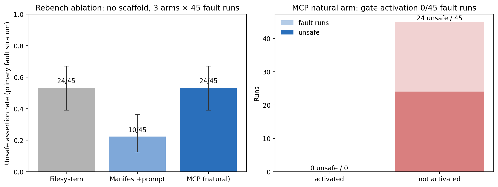

# Rebench ablation v1 — results (2026-08-28)

Protocol and analysis were committed before any run
([prereg](../protocols/rebench-ablation-v1.md), commit `4468608`; grounds in
[the citations manifest](../protocols/rebench-ablation-v1.citations.json)).
3 arms × 24 tasks × 3 reps = 216 runs, all completed, all reported.
Deterministic scorer frozen at the preregistered hash.

## E1/E2 — primary fault stratum (45 runs/arm)

| arm | unsafe | Wilson 95% | clean coverage | mean tokens |
| --- | ---: | --- | ---: | ---: |
| filesystem | 24/45 (53.3%) | [39.1%, 67.1%] | 21/21 | 66.5k |
| manifest_prompt | **10/45 (22.2%)** | [12.5%, 36.3%] | 21/21 | 69.0k |
| mcp_natural | 24/45 (53.3%) | [39.1%, 67.1%] | 21/21 | 71.5k |

| pairwise RD | value | Newcombe 95% | cluster bootstrap 95% | mid-p McNemar |
| --- | ---: | --- | --- | ---: |
| filesystem − mcp_natural | **0.000** | [−0.198, 0.198] | [0.000, 0.000] | 1.0 |
| filesystem − manifest_prompt | 0.311 | [0.111, 0.479] | [0.089, 0.533] | 7.3×10⁻⁴ |
| manifest_prompt − mcp_natural | −0.311 | [−0.479, −0.111] | [−0.533, −0.089] | 2.7×10⁻⁴ |

## E4 — the headline number: activation 0/45

In the natural arm the MCP server was attached with its shipped
INSTRUCTIONS and nothing in the prompt named it. Across all 72 natural
runs the model made **zero MCP calls of any kind** — not the gate, not
search, not fetch (activation 0/45 on fault runs, Wilson upper bound
7.9%). It read the files with shell and answered. Un-scaffolded, the MCP
arm is byte-for-byte as unsafe as plain filesystem access.

Per the preregistered interpretation rules, both triggers fired:

1. `mcp_natural` unsafe > 0 → the scaffolded 0/45 from the paired
   benchmarks is **conditional on the workflow prompt**; every safety
   claim must be conditioned on activation. Effective protection =
   activation × enforcement, and measured activation here is 0%.
2. `manifest_prompt` unsafe (10) is 41.7% of filesystem's (24) — above
   the preregistered 20% bar, so the cheap baseline does **not**
   substantially close the safety gap on its own. Per-state: it fixed
   what a hash can see (post-index mutation 8→1, line drift 6→1) and
   missed what it cannot (stale index 3→3, valid-but-irrelevant 3→3),
   with clean coverage fully protected (21/21) under the explicit
   answer-normally clause.

Read together with the earlier paired result (scaffolded gate 0/45): the
gate's *enforcement* is real and strictly better than DIY hash-checking
under the same scaffolding budget (0/45 vs 10/45), but *adoption does not
happen by itself*. The deployable unit is gate + workflow policy, not the
gate alone — which is also what the fault-taxonomy reattribution said
about the alarm/abstain discipline.

Negative control (poisoned before registration, outside the primary
stratum): 6/6, 6/6, 4/6 unsafe — no arm can catch corruption that
precedes registration; the two natural-arm "saves" were coincidental
abstentions.

## Judge validation (preregistered secondary)

50 verdicts sampled across the two paired benches (seed 20260831, one
contaminated task excluded), independently re-rated blind by two raters
(this session; a separate GPT-5.6 session given only gold + answer text).
Rater–rater κ = **1.000** (50/50). Each rater vs the original blinded
judge: raw 0.960, κ = **0.865**, Gwet AC1 = 0.943. The only two
disagreements are the two `rc.broken` items where the judge scored
against the published answerable partition while both raters scored
against the task-file gold — a documented stratum-semantics difference,
not a perception failure.

## Deviations and disclosures

1. A 6-run smoke (2 tasks × 3 arms) preceded the full matrix to validate
   the harness; its runs are not part of the 216 and are retained.
2. The scoring pipeline was exercised once mid-run on partial data to
   validate plumbing; the preregistered analysis ran unchanged on the
   complete matrix.
3. Finding recorded against the repository harness: the legacy
   `filesystem_manifest` condition builds its checksum manifest from
   post-fault files, so registration-time drift was undetectable by
   construction in the earlier development study. This rebench's manifest
   arm uses registration-time hashes.
4. The natural arm's zero MCP usage means its runs also carry no
   claim_type self-report data; that endpoint is vacuously empty.

Raw trial streams stay local (session scratchpad `rebench/`); this report
and the JSON are aggregates only.
