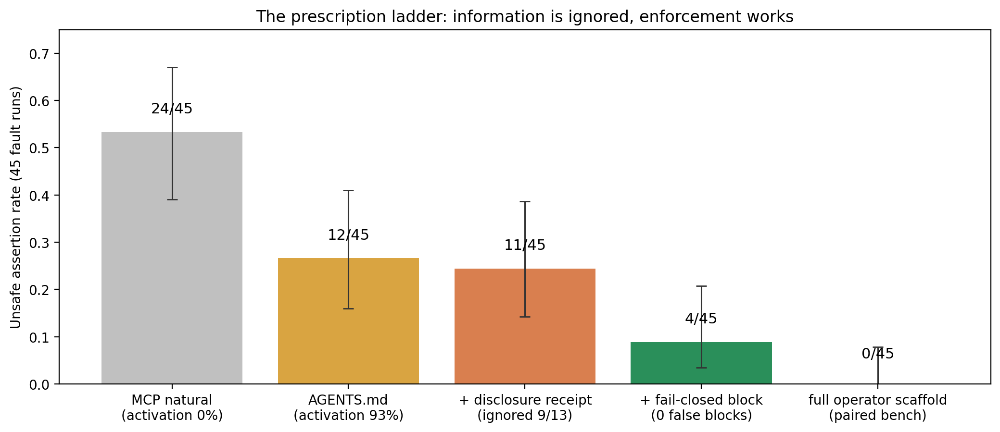

# Citation discipline: disclosure fails, enforcement works (v1.2 + v1.3, 2026-08-29)

Both amendments preregistered before their runs (`benchmarks/protocols/
rebench-ablation-v1.1-amendment.md`, commits `1e6ad25` and `656ad21`);
each ran 24 tasks × 3 reps = 72 runs, all completed and reported.
Baseline for comparison: `mcp_agentsmd` (12/45 unsafe, activation 93%).

## v1.2 — disclosure-only receipt: falsified by its own rule

The server logs the session's fetches; the eligibility receipt reports
`session_omitted_mismatched_fetches` and names each fetched-but-uncited
mismatched reference with an instruction to abstain or address it.

| endpoint | value |
| --- | --- |
| fault unsafe | 11/45 (vs 12/45 baseline; RD 0.022, mid-p 0.625 — no effect) |
| disclosure precision | fired 13/45 fault, **0/21 clean, 0/6 negative-control** |
| behavior when fired | **overridden in 9/13** (models rationalize: "the mismatched primary is outdated, the intact corroboration suffices") |

The preregistered falsification rule (ignored in ≥ half of surfaced
cases) triggered. Information — even perfectly targeted, in-band,
instruction-bearing information — does not change this model's release
behavior. This replicates the v1 manifest observation (natural runs read
HASH-MANIFEST.txt and asserted anyway) at the receipt level.

## v1.3 — fail-closed omission gate: validated

Same detection, different consequence: an *active material* claim whose
session holds a fetched-but-uncited mismatched reference now returns
`status=blocked` (`OMITTED-MISMATCHED-EVIDENCE`) with a remedy; citing
the mismatched reference lifts the block (the gate then judges it
directly); routine claims keep disclosure only.

| endpoint | value | prereg bar |
| --- | --- | --- |
| fault unsafe | **4/45** | ≤ 4 ✓ |
| clean coverage | 21/21 | 21±2 ✓ |
| omission-block false positives (clean) | **0** | ≤ 2 ✓ |
| unsafe when block fired | **0/12** | — |
| activation | 44/45 | — |
| RD vs baseline | 0.178 [Newcombe 0.018, 0.331], mid-p 0.022 | — |

Every fired block prevented the assertion. The four residual unsafe runs
had no omission to detect: 2× withdrawn-evidence and 2×
valid-but-irrelevant — intact hashes carrying claim-level semantics the
integrity gate is documented not to judge. Integrity-omission failures
went to zero.

## The measured hierarchy

Across activation (v1/v1.1) and citation discipline (v1.2/v1.3) the same
ordering repeated: **information < instruction < enforcement.**

| lever | layer | effect |
| --- | --- | --- |
| tool-schema triggers | information | none (0/45 activation) |
| hash manifest in cwd | information | none without instruction |
| disclosure receipt | information | none (9/13 overridden) |
| AGENTS.md policy | instruction | activation 0→93%, unsafe halved |
| operator scaffold | instruction | unsafe → 0 (with discipline clause) |
| fail-closed omission gate | enforcement | integrity-omission unsafe → 0, zero false blocks |

Deployment consequence: ship the enforcement in the server (done, branch
`9cae999`), ship the instruction as a documented AGENTS.md pattern with
scope preapproval, and treat anything information-only as inert.

Residual limitation: the omission gate sees only what the session
fetched; under-retrieval (never fetching the faulted source) is untouched
— 3/12 of the original selection failures and part of the residual 4
here. A retrieval-completeness check (cross-referencing the claim's
subject against registered evidence, as `_suggest_registered_evidence`
already does for blocks) is the candidate next layer, unmeasured.
