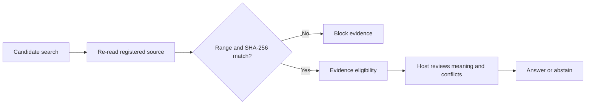

# Universal Research Framework Architecture

[60-second workflow](demo.md) · [Three design decisions](../README.md#three-design-decisions)



This workflow describes the supported read boundary. It is not a live trace or
proof of benchmark efficacy.

> Public integration scope for 0.8.5 is Codex only. Provider-backed runtime
> modules below are retained as repository prototypes, excluded from the PyPI
> wheel, and not covered by a public compatibility promise.

## Storage and authority flow

```text
append-only canonical JSONL
  → lexical / semantic derived indexes
  → candidate search
  → source or artifact verification
  → bounded claim / decision / audit finding
```

The Markdown TODO, WORK_LOG, and session notes are display adapters. They are
not canonical authority. A source-grounded conclusion requires an artifact
revision and a line, page, row, or structured-data locator.

## Implemented boundaries

- `schemas/` defines the versioned core, pack, and project-profile contracts.
- `universal_research_mcp/core/ledger.py` validates core records and legacy event compatibility without
  writing data.
- `universal_research_mcp/core/amendments.py` creates a narrow, fail-closed resolved view for completed
  payload amendments without changing canonical records.
- `universal_research_mcp/core/input.py` supplies approval-checked append
  validation and persistence. `universal_research_mcp/core/ingest.py` exposes
  it to the unified MCP only through immutable prepare/commit drafts. A
  separate `runtime/ingest_approval.py` authority signs one-time receipts under
  host state outside the project; exact draft hash, canonical-head, source
  SHA-256, receipt, pre-existing human scope, and one-time consumption are all
  rechecked before append. A write-ahead journal binds exact per-file
  before/after hashes and permits only an idempotent resume of the same partial
  transaction; the draft is consumed after all canonical operations verify.
- `universal_research_mcp/core/audit.py` derives read-only findings with record-addressable evidence.
- `scripts/validate_research_ledger.py` is a repository-only ledger validation entry
  point.
- `universal_research_mcp/core/indexing.py` projects Core 1.0 records into a compatibility retrieval
  document; canonical JSONL remains unchanged and is retained as `raw_json`.
- `mcp/research_memory/` is the source-tree compatibility launcher for the
  unified installable MCP. Evidence fetch is allowlisted to indexed source
  candidates and verifies the exact event/hash revision.
- `universal_research_mcp/indexing/` initializes empty databases and promotes
  lexical/semantic rebuilds only after staging, provenance, vector, retrieval,
  and integrity checks. Failed builds preserve the previous good database and
  emit derived health state.
- The retired provider/parallel-harness/agent-runtime prototypes were removed
  from the working tree and are preserved unchanged on the
  `archive/legacy-prototypes` branch. They were never packaged, registered by
  the Codex plugin, or reachable from the supported CLI surface.
- `universal_research_mcp/` publicly provides the default research-memory MCP
  and one management CLI. The MCP's two mutating ingestion tools are marked
  non-read-only/non-idempotent for the host and cannot create approvals or
  accept self-asserted approval. They accept an explicit project root and never
  use a reference-project runtime path. Provider execution modules are not
  registered by the Codex plugin, exposed through a distribution console entry
  point, or included in the public wheel.
- The MCP transport requires the documented `mcp[cli]` runtime. Pure ledger and
  lexical-query contract tests do not import that optional transport runtime.
- `packs/` adds constraints without relaxing the core policy.

## Deliberately outside the MCP authority

- Automatic amendments, self-created approvals, or unbound canonical writes
- Unapproved index/model/provider execution or background watchers
- Automatic audit dispositions or approval decisions
- Reference-project data migration or runtime sharing

## Governed multi-agent foundation

`universal_research_mcp/core/governance.py` adds an execution-backend-independent control plane for a
fixed eleven-role research roster. It validates task packets and decision records,
enforces Lightweight/Benchmark/Final-review activation, blocks reviewer
execution authority, and derives user-decision claim gates from critical/high
findings. Provider-neutral execution is isolated in the bounded harness rather
than granted to the governance role itself.

`universal_research_mcp/core/index_refresh.py` separates a canonical research event from its derived
search projection: it decides whether a recorded event is eligible to trigger a
refresh and validates the resulting index-health record, but it does not write
an index. `docs/multi-agent-governance.md` specifies the full policy.
