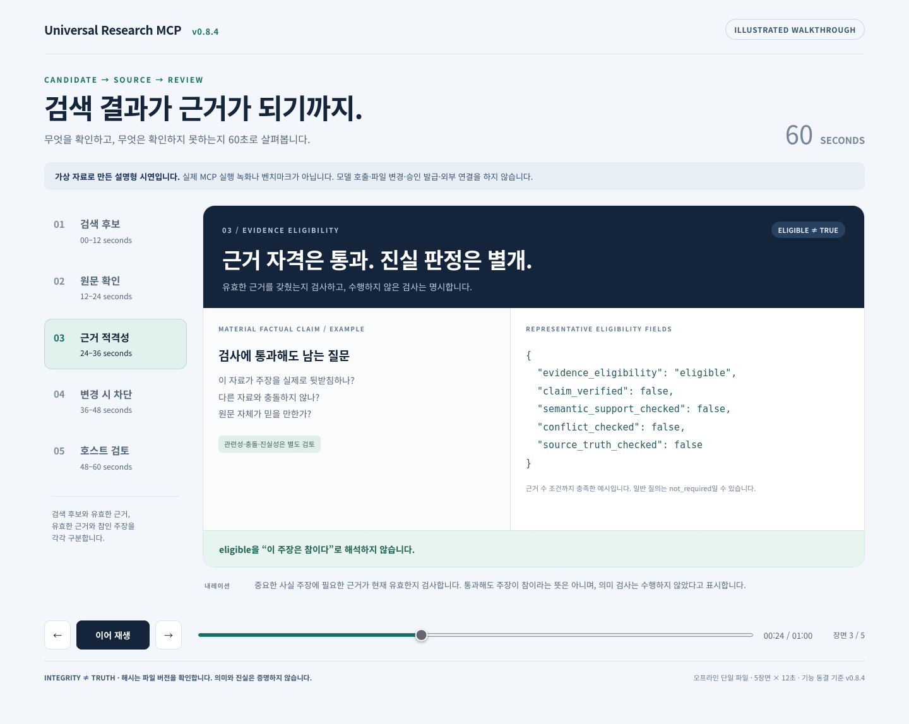

# 1분 데모 — 검색 후보에서 검토 가능한 근거까지

**v0.8.4 · 60초 설명형 시연 · 실제 실행 녹화 아님**

[인터랙티브 시연 파일](demo.html) · [아키텍처](assets/architecture-overview.svg) ·
[면접 설명문](portfolio.md) · [README](../README.md)

## 보는 방법

저장소를 내려받았다면 `docs/demo.html`을 브라우저로 연다. GitHub에서 보고
있다면 해당 HTML 파일을 내려받아 연다. 파일 하나로 동작하며 추가 설치,
서버, API 키, 외부 리소스가 필요 없다.

**‘60초 재생’**을 누르면 다섯 장면을 각각 12초씩 보여준다. 일시정지,
이전·다음, 시간 막대로 특정 장면을 살펴볼 수 있다. 키보드로도 버튼과
시간 막대를 조작할 수 있다.

이 시연은 동작 원리를 설명하기 위한 가상의 자료와 축약된 응답 필드를 사용한다.
실제 검색, 모델 실행, 파일 변경, 승인 발급, 인덱스 생성은 하지 않는다.
화면의 `true`나 `eligible`은 새 실험 결과 또는 실제 검증 영수증이 아니다.

## 60초 구성과 내레이션

| 구간 | 화면 | 말할 내용 |
| --- | --- | --- |
| **00–12초** | 검색 후보 | “검색 결과를 찾았지만 아직 검증된 근거는 아닙니다. 후보임을 명시하고 정확한 원문 위치를 넘깁니다.” |
| **12–24초** | 원문과 등록 정보 확인 | “이벤트, 파일 경로, 등록된 줄 범위와 SHA-256을 확인합니다. 주변 문맥은 보여줄 수 있지만 인용 범위를 바꾸지는 않습니다.” |
| **24–36초** | 근거 적격성 응답 | “중요한 사실 주장에 필요한 근거가 현재 유효한지 검사합니다. 통과해도 주장이 참이라는 뜻은 아니며, 의미 검사는 수행하지 않았다고 표시합니다.” |
| **36–48초** | 파일 변경 시 차단 | “등록 후 파일이 바뀌면 내용은 기본적으로 숨기고 적격성을 차단합니다. 진단 모드로 읽는 것은 근거 자격을 복구하지 않습니다.” |
| **48–60초** | 호스트의 최종 검토 | “호스트는 관련성과 충돌을 검토한 뒤 답하거나 보류합니다. 기록을 변경하려면 이 조회 흐름과 별개로 외부 승인이 필요합니다.” |

60초는 시연 페이지의 재생 길이다. 내레이션은 발표용 초안이며 녹음이나 실제
MCP 실행 시간의 측정값이 아니다.

## 실제 구현과 대응하는 부분

| 장면 | 구현 근거 | 화면에서 단순화한 부분 |
| --- | --- | --- |
| 검색 | [`memory_search_candidates`](../universal_research_mcp/server.py), [`test_research_memory_server.py`](../tests/test_research_memory_server.py) | 검색 순위, 이벤트 ID와 파일 내용은 예시다. |
| 원문 확인 | [`memory_fetch_evidence`](../universal_research_mcp/server.py) | 전체 SHA-256과 응답은 생략한다. `claim_gate_reference`는 원래 등록 범위를 유지한다. |
| 적격성 | [`evaluate_evidence_eligibility`](../universal_research_mcp/core/claim_gate.py), [`test_memory_claim_gate.py`](../tests/test_memory_claim_gate.py) | 중요한 사실 주장에 대해 근거 수 조건까지 충족한 예시다. 일반 질의는 `not_required`일 수 있다. |
| 변경 차단 | [`_claim_evidence_check`](../universal_research_mcp/server.py) | fetch의 `content_withheld`와 별도 적격성 검사 결과를 나눠 표시한다. |
| 최종 검토 | [보안 모델](security.md), [원본과 파생 뷰](decisions/0001-canonical-authority.md) | 관련성·충돌 검토를 자동 판정한 것처럼 표시하지 않는다. |

## 실제 실행을 녹화하려면

이 페이지를 실제 실행 영상이라고 소개하지 않는다. 실사용 녹화는
[입력 튜토리얼](input-cli-tutorial.md)에 따라 별도의 빈 데모 프로젝트와
가상의 원본을 준비하고, 필요한 기록·승인을 명시한 뒤 수행해야 한다.
설치, 모델 선택, 호출 비용, 파일 쓰기와 실행 범위는 그 작업에서 따로 확인한다.
참고 프로젝트나 기존 연구 데이터를 시연용으로 바꾸지 않는다.

완료된 실험을 보여줄 때는 [공개 결과 보고서](../benchmarks/results/README.md)를
사용한다. 이 설명형 페이지를 벤치마크 또는 운영 검증의 대체물로 사용하지 않는다.
